# 🛒 Walmart Sales EDA(Exploratory Data Analysis) - Full Project Journal

### <b><font color= #FFFF00> General Topics:
- #### *Import the libraries*
- #### *Load the Dataset*
- #### *Drop Duplicate Rows*
- #### *Change column format(if need)*

```python
import numpy as np
import pandas as pd
import matplotlib.pyplot as plt
import seaborn as sns
```

```python
df = pd.read_csv(r"D:\B_Data_Anlysist_Project\Python_Projects\02_Walmart_EDA\eda_walmart_sales_dataset.csv")
df.head()
```

```python
df.info()
```
    <class 'pandas.core.frame.DataFrame'>
    RangeIndex: 1000 entries, 0 to 999
    Data columns (total 10 columns):
     #   Column         Non-Null Count  Dtype  
    ---  ------         --------------  -----  
     0   Order ID       1000 non-null   object 
     1   Order Date     1000 non-null   object 
     2   Customer ID    1000 non-null   object 
     3   Customer Name  1000 non-null   object 
     4   City           1000 non-null   object 
     5   Region         1000 non-null   object 
     6   Category       1000 non-null   object 
     7   Quantity       1000 non-null   int64  
     8   Sales          1000 non-null   float64
     9   Profit         1000 non-null   float64
    dtypes: float64(2), int64(1), object(7)
    memory usage: 78.3+ KB

```python
df.drop_duplicates(inplace= True)
```

```python
df["Order Date"] = pd.to_datetime(df["Order Date"])
```

```python
df.info()
```

    <class 'pandas.core.frame.DataFrame'>
    RangeIndex: 1000 entries, 0 to 999
    Data columns (total 10 columns):
     #   Column         Non-Null Count  Dtype         
    ---  ------         --------------  -----         
     0   Order ID       1000 non-null   object        
     1   Order Date     1000 non-null   datetime64[ns]
     2   Customer ID    1000 non-null   object        
     3   Customer Name  1000 non-null   object        
     4   City           1000 non-null   object        
     5   Region         1000 non-null   object        
     6   Category       1000 non-null   object        
     7   Quantity       1000 non-null   int64         
     8   Sales          1000 non-null   float64       
     9   Profit         1000 non-null   float64       
    dtypes: datetime64[ns](1), float64(2), int64(1), object(6)
    memory usage: 78.3+ KB

### <b><font color= #FFFF00> Q1.Customer Segmentation Challenge:
#### *Identify the top 10% of customers who contributed the most to the total profit. What common characteristics (region, category, city) do they share?*

```python
customer_profit = df.groupby("Customer ID")["Profit"].sum().reset_index()
customer_profit
```

```python
customer_profit = customer_profit.sort_values(by= "Profit", ascending= False)
customer_profit
```

```python
top_10_percent_num = int(0.10 * customer_profit.shape[0])
top_10_percent_num
```

```python
top_10_percent_df = customer_profit.head(top_10_percent_num)
top_10_percent_df
```

```python
top_df = df[df["Customer ID"].isin(top_10_percent_df["Customer ID"])]
top_df
```

### <b><font color= #FFFF00> Region column:

```python
region = top_df["Region"].value_counts()
region_index = region.index
region_values = region.values
```

```python
region = top_df["Region"].value_counts()
region
```

    Region
    West     30
    East     26
    North    25
    South    25
    Name: count, dtype: int64

```python
sns.barplot(x= region_index, y= region_values)
plt.show
```

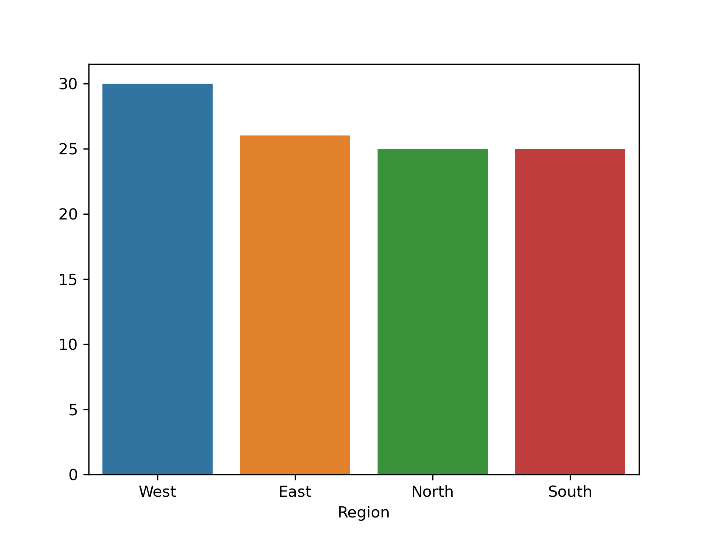
    
### <b><font color= #FFFF00> Category column:

```python
category = top_df["Category"].value_counts()
category_index = category.index
category_value = category.values
```

```python
print(top_df["Category"].value_counts())
```

    Category
    Furniture          39
    Office Supplies    37
    Technology         30
    Name: count, dtype: int64

```python
sns.barplot(x= category_index,y= category_value)
plt.show()
```
  
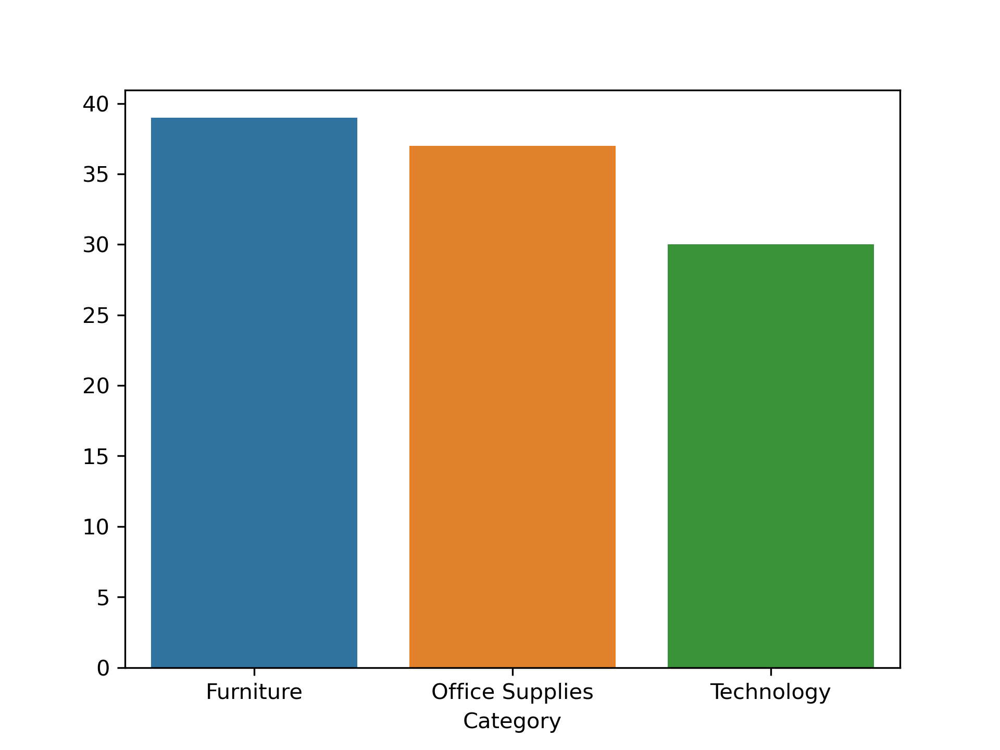
    
```python
print(top_df["City"].value_counts().head(10))
```

    City
    South Megan          2
    South Alyssamouth    1
    Reyesmouth           1
    North Sandyfurt      1
    South Ashleyhaven    1
    Craigport            1
    New Stephanie        1
    Ricefurt             1
    Melissatown          1
    New Rachaelhaven     1
    Name: count, dtype: int64

### <b> <font color= #ABFF00> Conclusion:
- #### `Region`: Distribution is fairly even, but [East] has a slight edge.
- #### `Category`: [Furniture] appears more frequently.
- #### `City`: One or two cities like [South Megan] show up more than once, but no strong city dominance.

### <b><font color= #FFFF00> Q2. Monthly Sales Recovery Strategy:
#### *Determine which month in the past year had the lowest overall profit. What specific product category and region contributed most to this loss?*

```python
df_loss = pd.DataFrame(df)
df_loss.head()
```

```python
df_loss["Order Date"].nunique()
```

```python
df_loss["Year"] = df_loss["Order Date"].dt.year
```

```python
df_loss["Month"] = df_loss["Order Date"].dt.month
```

```python
df_loss["Year"].unique()
```
array([2024, 2023, 2025])

```python
df_loss["Year"].value_counts()
```
    Year
    2024    492
    2025    275
    2023    233
    Name: count, dtype: int64
```python
df_2024 = df_loss[df_loss["Year"] == 2024]
df_2024
```

### <b><font color= #FFFF00> Monthly profit:

```python
df_2024_months = df_2024.groupby("Month")["Profit"].sum().reset_index()
df_2024_months
```

```python
df_2024_months = df_2024_months.sort_values(by= "Profit", ascending= False)
df_2024_months
```

```python
sns.barplot(x= df_2024_months["Month"], y= df_2024_months["Profit"])
plt.show()
```
    
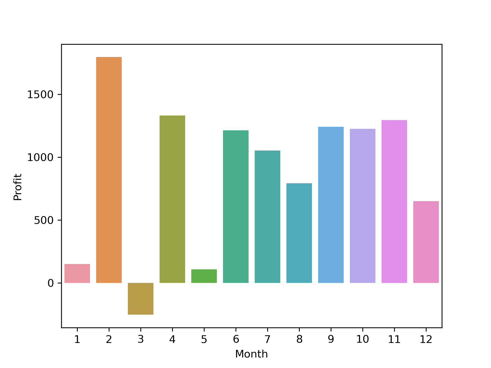
    
```python
df_march = df_2024[df_2024["Month"] == 3]
df_march.head()
```

```python
df_march["Profit"].info()
```

    <class 'pandas.core.series.Series'>
    Index: 41 entries, 8 to 993
    Series name: Profit
    Non-Null Count  Dtype  
    --------------  -----  
    41 non-null     float64
    dtypes: float64(1)
    memory usage: 656.0 bytes

```python
df_march["Profit"].sum()
```

### <b><font color= #FFFF00> Region wise Distribution:

```python
df_march["Region"].value_counts()
```

    Region
    North    13
    South    11
    West     10
    East      7
    Name: count, dtype: int64

```python
region = df_march.groupby("Region")["Profit"].sum()
region
```

    Region
    East    -282.76
    North    574.55
    South   -486.86
    West     -57.15
    Name: Profit, dtype: float64

```python
region.index
region.values
sns.barplot(x= region.index, y= region.values)
plt.ylabel("Profit")
plt.show()
```
    
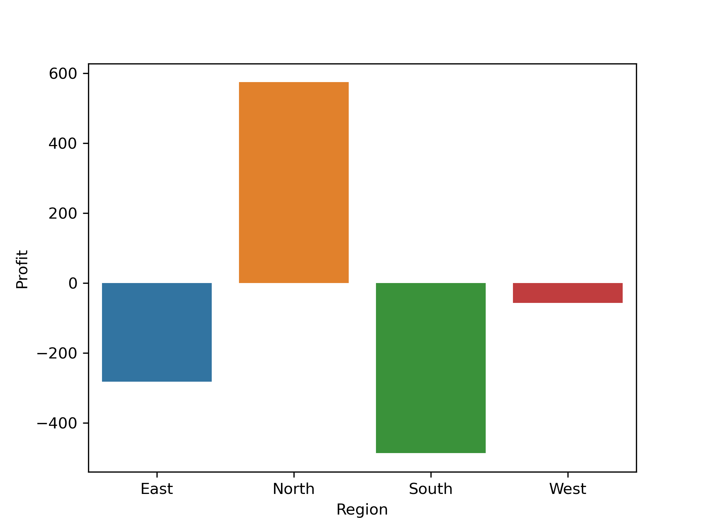
    

### <b><font color= #FFFF00> Category wise Distribution:

```python
df_march["Category"].value_counts()
```
    Category
    Office Supplies    18
    Furniture          12
    Technology         11
    Name: count, dtype: int64

```python
Category = df_march.groupby("Category")["Profit"].sum()
Category
```

    Category
    Furniture          199.04
    Office Supplies   -307.96
    Technology        -143.30
    Name: Profit, dtype: float64

```python
Category.index
Category.values
sns.barplot(x= Category.index, y= Category.values)
plt.ylabel("Profit")
plt.show()
```
    
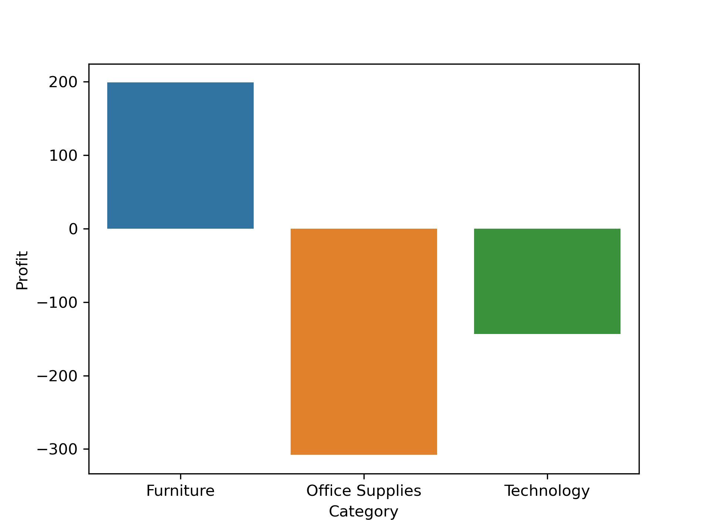
    
### <b><font color= #FFFF00> Both wise Distribution:

```python
df_march.groupby(["Category","Region"])["Profit"].sum()
```

    Category         Region
    Furniture        East     -150.12
                     North     340.85
                     South     -16.23
                     West       24.54
    Office Supplies  East     -187.05
                     North     266.55
                     South    -365.34
                     West      -22.12
    Technology       East       54.41
                     North     -32.85
                     South    -105.29
                     West      -59.57
    Name: Profit, dtype: float64

```python
grouped = df_march.groupby(["Category", "Region"])["Profit"].sum().reset_index()
```

```python
sns.barplot(x="Category", y="Profit", hue="Region", data=grouped)
plt.show()
```
    
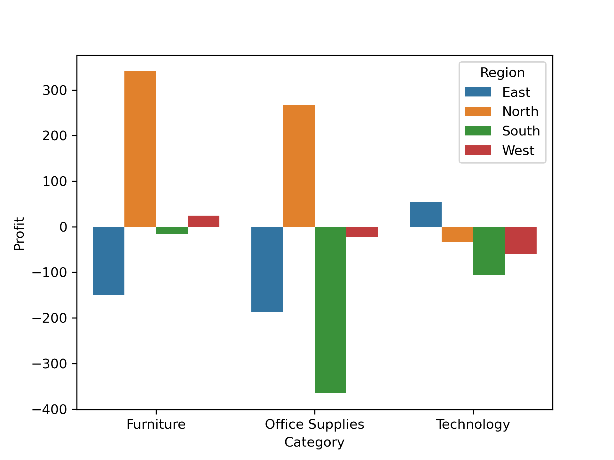
    
### <b> <font color= #ABFF00> Conclusion:
- #### Past year is `2024` – 492 records.
- #### `March` Month make the least amount of loss profit. Loss is `-252.22`.
- #### March month dissection Region wise `South` made a more amount of lose. Loss is `-486.86`.
- #### Category wise `Office Supplies` made a more amount of lose. Loss is `-307.96`.
- #### Both `Region` and `Category` wise `south` & `Office Supplies` made a more amount of lose. Loss is `-365.34`.

### <b><font color= #FFFF00> Q3. Profitability Anomaly Detection:
#### *Identify any orders with high sales but negative profit. What patterns do you notice in terms of region, category, or quantity?*

```python
df_anomaly = pd.DataFrame(df)
df_anomaly
```

```python
df_neg_profit = df_anomaly[df_anomaly["Profit"] < 0]
df_neg_profit
```

```python
df_neg_profit.groupby("Category").agg({"Category" : "count"})
```

```python
df_neg_profit["Quantity"].unique()
```

array([7, 8, 6, 2, 1, 9, 3, 5, 4], dtype=int64)

### <b><font color= #FFFF00> Furniture Distribution:

```python
df_count_furniture = df_neg_profit[df_neg_profit["Category"] == "Furniture"].groupby("Quantity")["Profit"].count()
df_count_furniture
```
    Quantity
    1    16
    2    10
    3    14
    4     7
    5     9
    6    19
    7    14
    8    15
    9    11
    Name: Profit, dtype: int64

```python
df_neg_profit_furniture = df_neg_profit[df_neg_profit["Category"] == "Furniture"].groupby("Quantity")["Profit"].sum()
df_neg_profit_furniture
```

    Quantity
    1    -802.44
    2    -577.02
    3    -805.80
    4    -389.89
    5    -630.29
    6   -1181.15
    7    -607.38
    8    -688.04
    9    -532.80
    Name: Profit, dtype: float64

```python
df_furniture = df_neg_profit[df_neg_profit["Category"] == "Furniture"].groupby("Quantity")["Sales"].sum()
df_furniture
```
    Quantity
    1    9013.62
    2    5562.43
    3    7801.78
    4    3806.66
    5    4987.83
    6    9700.03
    7    5712.62
    8    5971.68
    9    5570.56
    Name: Sales, dtype: float64

```python
plt.figure(figsize = (9,6))
sns.barplot(x= df_furniture.index, y= df_furniture.values)
plt.title("Furniture sales on Negative Profit")
plt.ylabel("Sales")
plt.show()
```
   
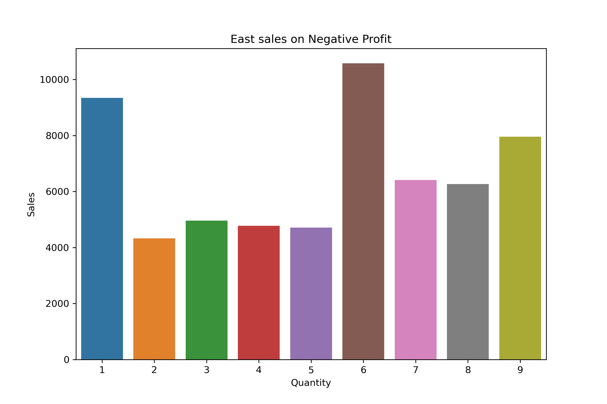

### <b><font color= #FFFF00> Office_Suppliers Distribution:

```python
df_count_Office_Supplies = df_neg_profit[df_neg_profit["Category"] == "Office Supplies"].groupby("Quantity")["Profit"].count()
df_count_Office_Supplies
```
    Quantity
    1    16
    2    13
    3    21
    4    12
    5    17
    6    18
    7    14
    8    15
    9    16
    Name: Profit, dtype: int64

```python
df_neg_Office_Supplies = df_neg_profit[df_neg_profit["Category"] == "Office Supplies"].groupby("Quantity")["Profit"].sum()
df_neg_Office_Supplies
```
    Quantity
    1    -876.00
    2    -661.01
    3    -924.51
    4    -628.67
    5    -691.39
    6   -1191.58
    7    -562.95
    8    -725.70
    9    -582.02
    Name: Profit, dtype: float64

```python
df_Office_Supplies = df_neg_profit[df_neg_profit["Category"] == "Office Supplies"].groupby("Quantity")["Sales"].sum()
df_Office_Supplies
```

    Quantity
    1     8454.98
    2     5615.46
    3    10234.87
    4     6603.31
    5     8006.98
    6     9938.60
    7     6935.57
    8     7224.52
    9     8494.63
    Name: Sales, dtype: float64

```python
plt.figure(figsize = (9,6))
sns.barplot(x= df_Office_Supplies.index, y= df_Office_Supplies.values)
plt.title("Office_Supplies sales on Negative Profit")
plt.ylabel("Sales")
plt.show()
```
    
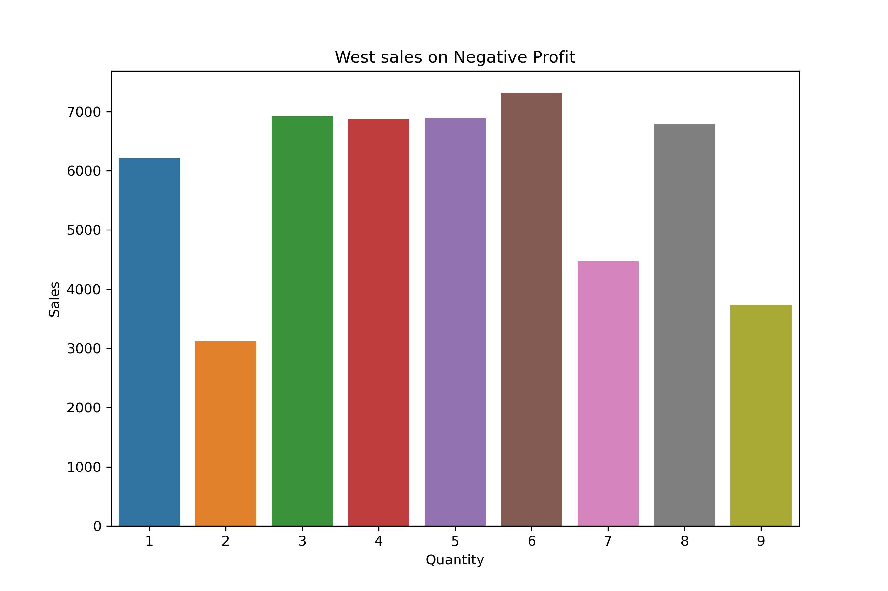
    

### <b><font color= #FFFF00> Technology Distribution:

```python
df_count_Technology = df_neg_profit[df_neg_profit["Category"] == "Technology"].groupby("Quantity")["Profit"].count()
df_count_Technology
```

    Quantity
    1    19
    2    14
    3    14
    4    16
    5    19
    6    20
    7    14
    8    11
    9    14
    Name: Profit, dtype: int64

```python
df_neg_Technology = df_neg_profit[df_neg_profit["Category"] == "Technology"].groupby("Quantity")["Profit"].sum()
df_neg_Technology
```
    Quantity
    1    -965.17
    2    -710.43
    3    -812.00
    4    -604.46
    5   -1283.44
    6    -960.39
    7    -625.54
    8    -518.92
    9    -884.20
    Name: Profit, dtype: float64

```python
df_Technology = df_neg_profit[df_neg_profit["Category"] == "Technology"].groupby("Quantity")["Sales"].sum()
df_Technology
```
    Quantity
    1    10400.94
    2     6155.91
    3     6783.78
    4     7235.92
    5    11130.52
    6    11033.73
    7     6800.03
    8     5772.87
    9     8434.57
    Name: Sales, dtype: float64

```python
plt.figure(figsize = (9,6))
sns.barplot(x= df_Technology.index, y= df_Technology.values)
plt.title("Technology sales on Negative Profit")
plt.ylabel("Sales")
plt.show()
```
  
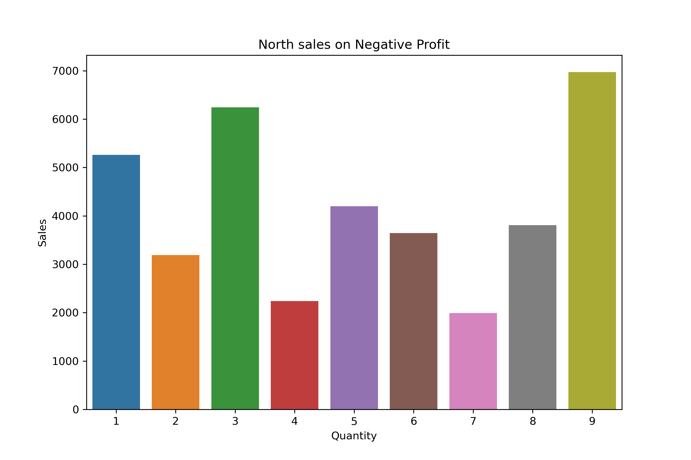   

### <b><font color= #FFFF00> East Region Distribution:

```python
df_neg_profit["Region"].unique()
```
    array(['South', 'East', 'North', 'West'], dtype=object)

```python
df_count_East = df_neg_profit[df_neg_profit["Region"] == "East"].groupby("Quantity")["Profit"].count()
df_count_East
```
    Quantity
    1    14
    2    10
    3    10
    4     7
    5    11
    6    19
    7    14
    8    13
    9    14
    Name: Profit, dtype: int64

```python
df_profit_East = df_neg_profit[df_neg_profit["Region"] == "East"].groupby("Quantity")["Profit"].sum()
df_profit_East
```
    Quantity
    1    -929.15
    2    -454.48
    3    -545.82
    4    -517.64
    5    -451.72
    6   -1240.21
    7    -704.56
    8    -669.10
    9    -681.08
    Name: Profit, dtype: float64

```python
df_sales_East = df_neg_profit[df_neg_profit["Region"] == "East"].groupby("Quantity")["Sales"].sum()
df_sales_East
```
    Quantity
    1     9344.71
    2     4328.10
    3     4958.74
    4     4776.51
    5     4709.89
    6    10578.75
    7     6412.53
    8     6265.65
    9     7954.16
    Name: Sales, dtype: float64

```python
plt.figure(figsize = (9,6))
sns.barplot(x= df_sales_East.index, y= df_sales_East.values)
plt.title("East sales on Negative Profit")
plt.ylabel("Sales")
plt.show()
```
  
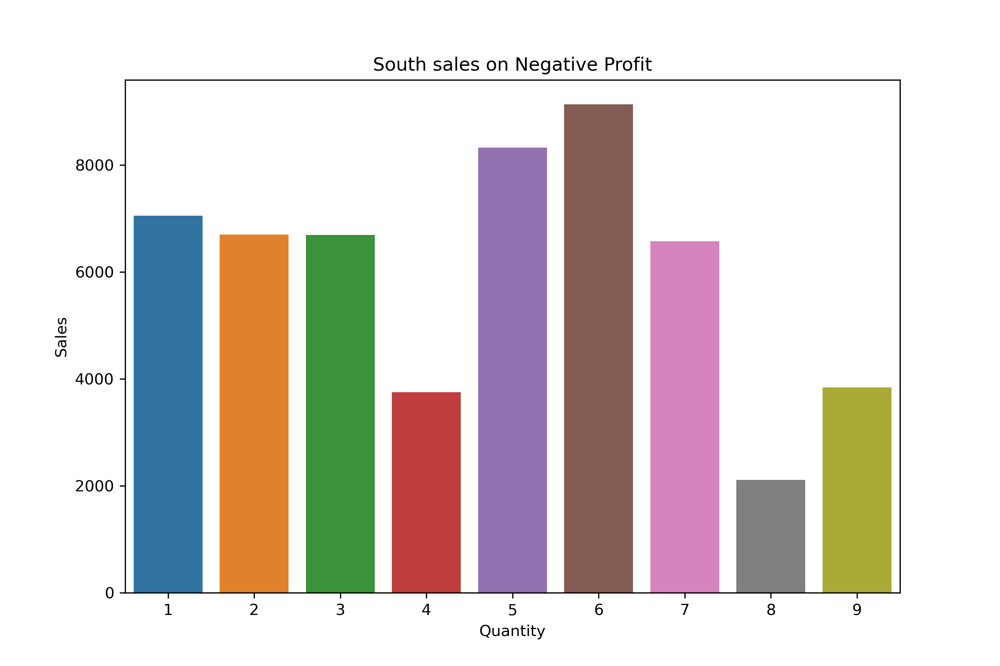
    

### <b><font color= #FFFF00> West Region Distribution:

```python
df_profit_West = df_neg_profit[df_neg_profit["Region"] == "West"].groupby("Quantity")["Profit"].count()
df_profit_West
```
    Quantity
    1    12
    2     9
    3    15
    4    14
    5    13
    6    13
    7    10
    8    15
    9    10
    Name: Profit, dtype: int64

```python
df_profit_West = df_neg_profit[df_neg_profit["Region"] == "West"].groupby("Quantity")["Profit"].sum()
df_profit_West
```
    Quantity
    1   -329.90
    2   -150.25
    3   -735.72
    4   -701.62
    5   -590.07
    6   -688.36
    7   -389.78
    8   -794.10
    9   -305.97
    Name: Profit, dtype: float64

```python
df_sales_West = df_neg_profit[df_neg_profit["Region"] == "West"].groupby("Quantity")["Sales"].sum()
df_sales_West
```

    Quantity
    1    6215.65
    2    3118.75
    3    6925.78
    4    6878.59
    5    6895.15
    6    7319.91
    7    4470.00
    8    6783.22
    9    3736.70
    Name: Sales, dtype: float64

```python
plt.figure(figsize = (9,6))
sns.barplot(x= df_sales_West.index, y= df_sales_West.values)
plt.title("West sales on Negative Profit")
plt.ylabel("Sales")
plt.show()
```   
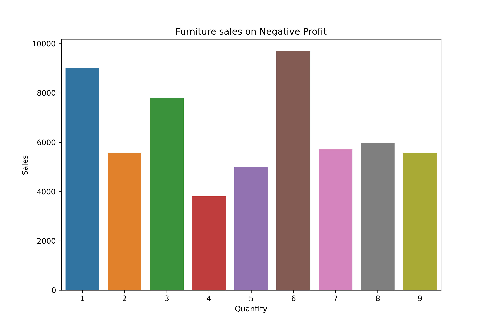
    
### <b><font color= #FFFF00> North Region Distribution:

```python
df_profit_North = df_neg_profit[df_neg_profit["Region"] == "North"].groupby("Quantity")["Profit"].count()
df_profit_North
```
    Quantity
    1    13
    2     6
    3    14
    4     5
    5     7
    6     9
    7     6
    8     9
    9    11
    Name: Profit, dtype: int64

```python
df_profit_North = df_neg_profit[df_neg_profit["Region"] == "North"].groupby("Quantity")["Profit"].sum()
df_profit_North
```
    Quantity
    1   -764.34
    2   -285.40
    3   -730.11
    4   -133.06
    5   -623.66
    6   -402.46
    7   -162.61
    8   -299.10
    9   -827.33
    Name: Profit, dtype: float64

```python
df_profit_North = df_neg_profit[df_neg_profit["Region"] == "North"].groupby("Quantity")["Sales"].sum()
df_profit_North
```
    Quantity
    1    5257.83
    2    3190.53
    3    6243.89
    4    2241.93
    5    4197.23
    6    3641.99
    7    1992.01
    8    3807.97
    9    6971.56
    Name: Sales, dtype: float64

```python
plt.figure(figsize = (9,6))
sns.barplot(x= df_profit_North.index, y= df_profit_North.values)
plt.title("North sales on Negative Profit")
plt.ylabel("Sales")
plt.show()
```
    
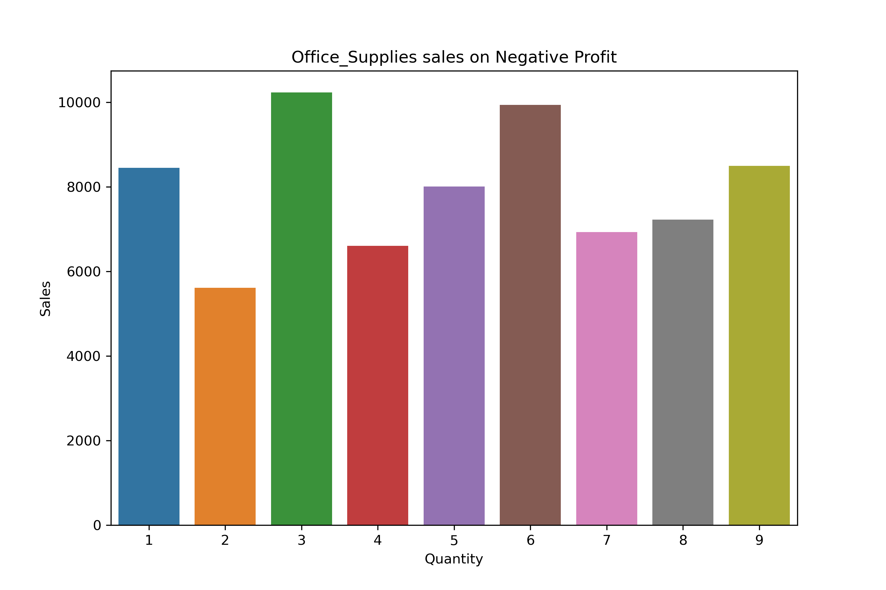    

### <b><font color= #FFFF00> South Region Distribution:

```python
df_profit_South = df_neg_profit[df_neg_profit["Region"] == "South"].groupby("Quantity")["Profit"].count()
df_profit_South
```
    Quantity
    1    12
    2    12
    3    10
    4     9
    5    14
    6    16
    7    12
    8     4
    9     6
    Name: Profit, dtype: int64

```python
df_profit_South = df_neg_profit[df_neg_profit["Region"] == "South"].groupby("Quantity")["Profit"].sum()
df_profit_South
```
    Quantity
    1    -620.22
    2   -1058.33
    3    -530.66
    4    -270.70
    5    -939.67
    6   -1002.09
    7    -538.92
    8    -170.36
    9    -184.64
    Name: Profit, dtype: float64

```python
df_profit_South = df_neg_profit[df_neg_profit["Region"] == "South"].groupby("Quantity")["Sales"].sum()
df_profit_South
```
    Quantity
    1    7051.35
    2    6696.42
    3    6692.02
    4    3748.86
    5    8323.06
    6    9131.71
    7    6573.68
    8    2112.23
    9    3837.34
    Name: Sales, dtype: float64

```python
plt.figure(figsize = (9,6))
sns.barplot(x= df_profit_South.index, y= df_profit_South.values)
plt.title("South sales on Negative Profit")
plt.ylabel("Sales")
plt.show()
```
  
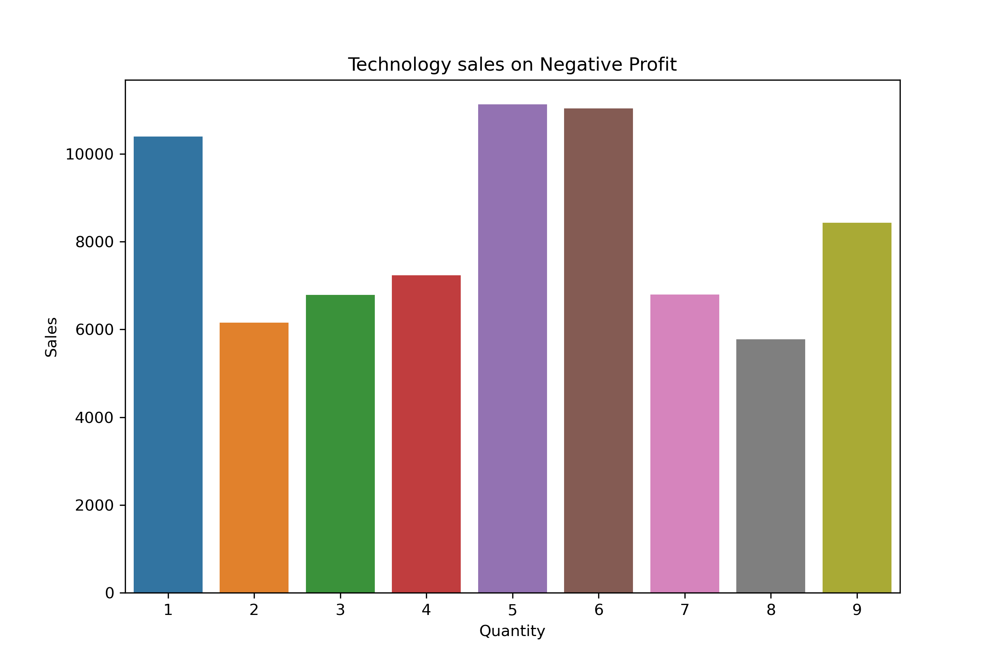
    
### <b><font color= #FFFF00> Overall Visualization:

```python
category_sales = df_neg_profit.pivot_table(index="Quantity", columns="Category", values="Sales", aggfunc="sum")
category_sales.plot(kind="bar", figsize=(10,6))
plt.title("Negative Profit: Sales by Quantity and Category")
plt.ylabel("Sales")
plt.show()
```
   
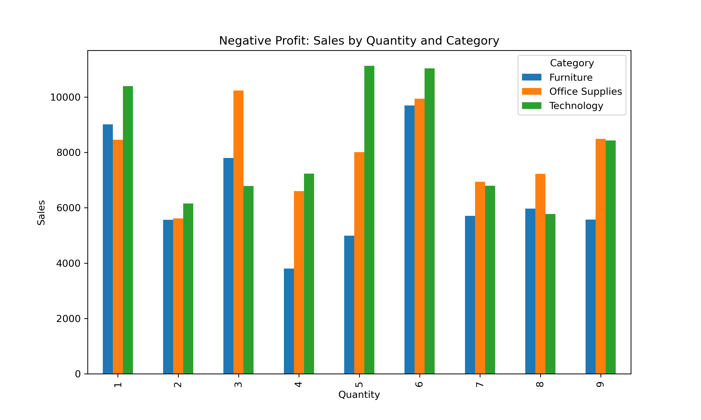
    
```python
region_quantity = df_neg_profit.pivot_table(index="Quantity", columns="Region", values="Sales", aggfunc="sum")
sns.heatmap(region_quantity, annot=True, cmap="YlOrRd", fmt=".0f")
plt.title("Sales with Negative Profit by Quantity and Region")
plt.show()
```
  
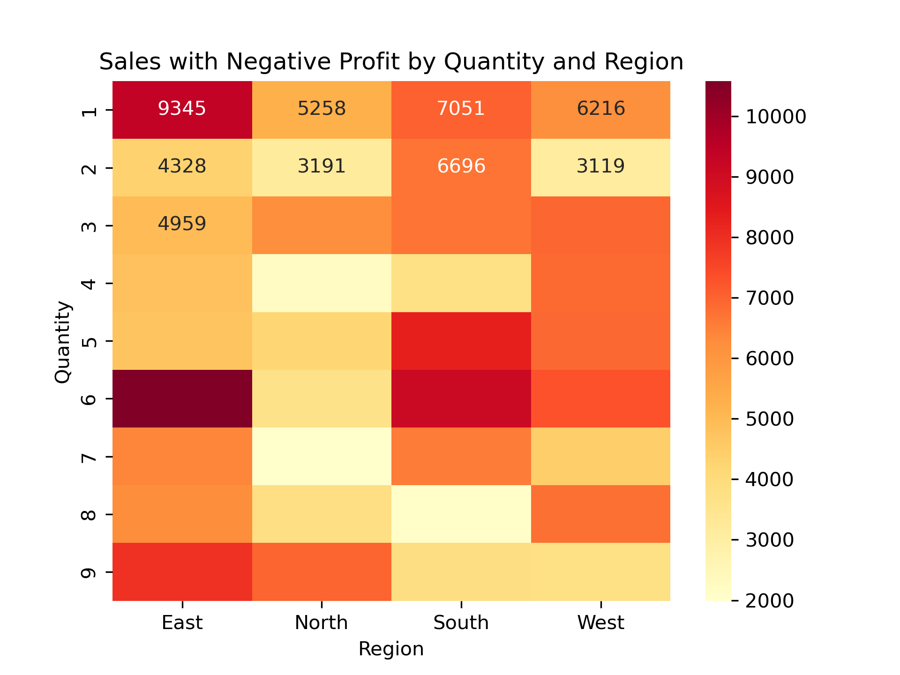
    
### <b> <font color= #ABFF00> Conclusion:
- #### The same quantities — especially `1`, `3`, and `6` units — are showing up again and again in loss-making orders.
- #### This happens in all product categories (Furniture, Office Supplies, Technology).
- #### It also happens in all regions (East, West, North, South).
- #### This tells us that small quantity orders, even when they have high sales, are still not profitable.

### <b><font color= #FFFF00> Q4. Optimizing Product Mix for Regions:
#### *For each region, find the best-selling category by volume and the most profitable category. Are they the same? What does this imply?*

```python
df_product_mix = pd.DataFrame(df)
df_product_mix.head()
```

```python
df_product_mix.groupby(["Region","Category"])["Sales"].sum()
```

    Region  Category       
    East    Furniture          44515.40
            Office Supplies    43166.97
            Technology         51097.55
    North   Furniture          39738.54
            Office Supplies    40463.24
            Technology         39787.34
    South   Furniture          40073.94
            Office Supplies    46950.11
            Technology         37103.00
    West    Furniture          44470.98
            Office Supplies    39181.65
            Technology         41876.95
    Name: Sales, dtype: float64

```python
df_sales = df_product_mix.pivot_table(index= "Region", columns= "Category", values= "Sales", aggfunc= "sum")
df_sales
```
 
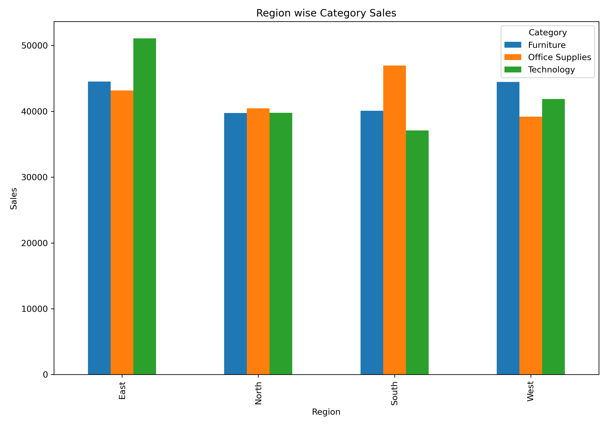

```python
df_profit = df_product_mix.pivot_table(index= "Region", columns= "Category", values= "Profit", aggfunc= "sum")
df_profit
```

```python
df_profit.plot(kind= "bar", figsize= (10,7))
plt.title("Region wise Category Profit")
plt.ylabel("Profit")
plt.tight_layout()
plt.show()
```
   
```python
df_north_office = df_product_mix[(df_product_mix["Region"] == "North") & (df_product_mix["Category"] == "Office Supplies")]
df_north_office
```

```python
df_north_neg = df_north_office[df_north_office["Profit"] < 0]
df_north_neg
```

```python
office_positive_profit = df_north_office.groupby("Quantity")["Profit"].sum()
sum(office_positive_profit.values)
```

```python
office_negative_profit = df_north_neg.groupby("Quantity")["Profit"].sum()
sum(office_negative_profit.values)
```

```python
df_north_furniture = df_product_mix[(df_product_mix["Region"] == "North") & (df_product_mix["Category"] == "Furniture")]
df_north_furniture
```

```python
df_north_fur_neg = df_north_office[df_north_office["Profit"] < 0]
df_north_fur_neg
```

```python
Furniture_positive_profit = df_north_furniture.groupby("Quantity")["Profit"].sum()
sum(Furniture_positive_profit.values)
```

```python
Furniture_negative_profit = df_north_fur_neg.groupby("Quantity")["Profit"].sum()
sum(Furniture_negative_profit.values)
```

### <b> <font color= #ABFF00> Conclusion:
- #### In the East, West, and South regions, the category with the highest sales also gave the highest profit. This shows that the current product mix in these regions is working well.
- #### In the North region, Office Supplies had the highest sales, but Furniture made more profit.
- #### Even though the sales difference between Office Supplies and Furniture was small (₹724), the profit difference was meaningful (₹705).
- #### On deeper analysis, Office Supplies in North had more negative profit orders, while Furniture mostly made positive profits.

### <b><font color= #FFFF00> Q5. Demand Prediction Case:
#### *Using historical data, identify if there is a trend or seasonal pattern in quantity sold for each product category over time.*

```python
df_trend_season = pd.DataFrame(df)
df_trend_season.head()
```

```python
df_trend_season["Order Date"] = pd.to_datetime(df_trend_season["Order Date"])
```

```python
df_trend_season["Year"] = df_trend_season["Order Date"].dt.year
```

```python
df_trend_season["Month"] = df_trend_season["Order Date"].dt.month
```

```python
df_trend_season["Year-Month"] = df_trend_season["Order Date"].dt.to_period("M")
```

```python
monthly_trend = df_trend_season.groupby(['Year-Month', 'Category'])['Quantity'].sum().reset_index()
monthly_trend
```

```python
pivot_df = monthly_trend.pivot(index='Year-Month', columns='Category', values='Quantity')
pivot_df
```

```python
pivot_df.plot(figsize=(12,6), marker='o')
plt.title("Monthly Quantity Sold by Category")
plt.ylabel("Total Quantity Sold")
plt.xlabel("Month")
plt.xticks(rotation=45)
plt.grid(True)
plt.tight_layout()
plt.show()
```
  
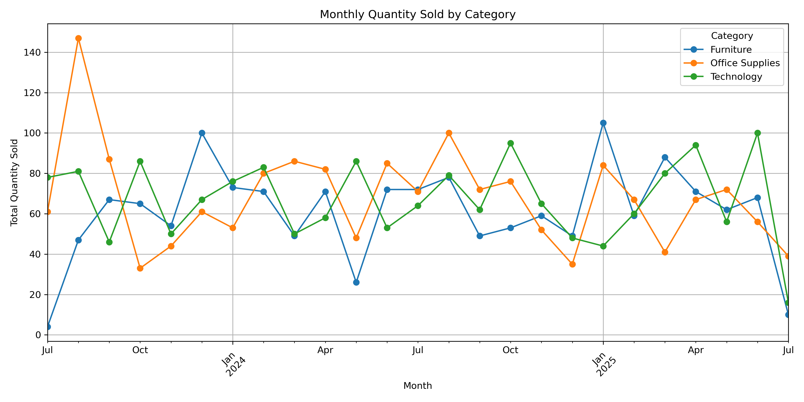
    
### <b> <font color= #ABFF00> Conclusion:
#### There is both a trend and seasonality present in the quantity sold over time:
- #### Trends: Increasing demand (especially for Office Supplies).
- #### Seasonality: Regular peaks at specific months across years.

### <b><font color= #FFFF00> Q6. Loss-Leading Product Investigation:
#### *Find products or categories that have repeatedly shown negative profit despite high sales. Should they be discontinued or repriced?*

```python
df_high_sales = pd.DataFrame(df)
df_high_sales.head()
```

```python
neg_profit = df_high_sales[df_high_sales["Profit"] < 0]
neg_profit
```

```python
neg_profit.groupby("Category")["Sales"].sum()
```
    Category
    Furniture          58127.21
    Office Supplies    71508.92
    Technology         73748.27
    Name: Sales, dtype: float64

```python
neg_profit.groupby("Category")["Profit"].sum()
```

    Category
    Furniture         -6214.81
    Office Supplies   -6843.83
    Technology        -7364.55
    Name: Profit, dtype: float64

```python
tech_sort = neg_profit[neg_profit["Category"] == "Technology"]
tech_sort
```

```python
tech_sort.groupby("Quantity").agg({
    "Quantity" : "count",
    "Sales" : "sum",
    "Profit" : "sum"
}).rename(columns= {"Quantity" : "Order_count"}).reset_index()
```

```python
tot = tech_sort.groupby(["Quantity"])["Sales"].sum()
tot_sum = sum(tot)
per = (tot.values/tot_sum)*100
```

### <b> <font color= #ABFF00> Conclusion:
- #### The `Technology` category accounts for the highest volume of negative-profit transactions, especially in quantity groups of `1`,`5`, and `6` units.
- #### These three quantity buckets alone contribute `45%` of loss transactions, indicating that these sales are frequent and significant.
- #### Since these products are selling well (high sales count), it’s more financially sound to reprice them (increase unit price, reduce discount) rather than discontinue them.

### <b><font color= #FFFF00> Q7. Regional Sales Consistency:
#### *Which region shows the most stable monthly sales performance over time? Use standard deviation or coefficient of variation to support your analysis.*

```python
df_std_cv = pd.DataFrame(df)
df_std_cv.head()
```

```python
df_std_cv["Order Date"] = pd.to_datetime(df_std_cv["Order Date"])
```

```python
df_std_cv["month_year"] = df_std_cv["Order Date"].dt.to_period("M")
```

```python
monthly_sales = df_std_cv.groupby(["Region", "month_year"])["Sales"].sum().reset_index()
monthly_sales
```

```python
region_sales = monthly_sales.groupby("Region")["Sales"].agg(["mean","std"]).reset_index()
region_sales
```

```python
region_sales["cv"] = region_sales["std"] / region_sales["mean"]
```

```python
region_sales.sort_values(by= "cv")
```

### <b> <font color= #ABFF00> Conclusion:
- #### Based on the coefficient of variation (CV) for monthly sales across regions, the North region has the most stable sales performance over time (CV = 0.36). 
- #### This indicates less fluctuation in monthly sales, making it the most consistent region in terms of sales.

### <b><font color= #FFFF00> Q8. Customer Retention Analysis:
#### *Based on Customer ID, find the number of repeats vs. one-time customers. How does their average profit and sales differ?*

```python
df_customer = pd.DataFrame(df)
```

```python
df_customer["Order Date"] = pd.to_datetime(df_customer["Order Date"])
```

```python
df_customer.head()
```

```python
customer_count = df_customer["Customer ID"].value_counts()
```

```python
df_customer["customer_type"] = df_customer["Customer ID"].apply(lambda x : "repeat" if customer_count[x] > 1 else "one_time")
```

```python
df_customer["customer_type"].value_counts()
```
    customer_type
    one_time    912
    repeat       88
    Name: count, dtype: int64
```python
customer_summary = df_customer.groupby("customer_type")[["Sales","Profit"]].sum()
customer_summary
```

```python
customer_summary["per_sales"] = round((customer_summary["Sales"]/ customer_summary["Sales"].sum())*100, 2)
```

```python
customer_summary["per_profit"] = round((customer_summary["Profit"]/ customer_summary["Profit"].sum())*100, 2)
```

```python
customer_summary
```

### <b> <font color= #ABFF00> Conclusion:
- #### Out of all customers, only a small portion are repeat customers, and they contribute ~9% of sales and ~10.5% of profit.
- #### The majority of revenue is currently driven by one-time customers, showing a potential gap in customer retention.
- #### There is no significant profitability difference between repeat and one-time buyers, indicating a possible opportunity to re-engage one-time buyers into becoming repeat customers.

### <b><font color= #FFFF00> Q9. Bulk Buying Patterns:
#### *Are their specific cities or regions where customers consistently buy in higher quantities than average? What product categories are driving this?*

```python
df_cit_reg = pd.DataFrame(df)
```

```python
region_agg = df_cit_reg.groupby("Region")[["Quantity"]].agg(["count","std","mean"]).reset_index()
```

```python
region_agg["total_avg"] = df_cit_reg["Quantity"].mean()
```

```python
region_agg
```

```python
a = df_cit_reg["City"].value_counts().reset_index()
a.columns = ["City", "count"]
b = a[a["count"] > 1]
```

```python
city_filter = df_cit_reg[df_cit_reg["City"].isin(b["City"])]
```

```python
city_agg = city_filter.groupby("City")[["Quantity"]].agg(["count","mean","std"]).reset_index()
```

```python
city_agg["total_avg"] = df_cit_reg["Quantity"].mean()
```

### <b> <font color= #ABFF00> Conclusion:
- #### The East and West regions show slightly above-average bulk buying behavior, with mean quantities above the overall average `(4.898)`.
- #### Standard deviation across regions is relatively consistent, indicating stable purchasing patterns.
- #### City-level analysis was inconclusive, as most cities appeared only once in the dataset and do not provide enough volume to draw meaningful conclusions.

### <b><font color= #FFFF00> Q10. Sales Efficiency Score:
#### *Create a new metric: Profit per Unit Sold. Rank cities based on this efficiency. What actionable insights can Walmart take?*

```python
df_pro_per_unit = pd.DataFrame(df)
df_pro_per_unit.head()
```

```python
df_city_cal = df_pro_per_unit.groupby("City")[["Quantity", "Profit"]].sum().reset_index()
df_city_cal.columns = ["City", "Quantity", "Profit"]
df_city_cal
```

```python
df_city_cal["Per_unit"] = df_city_cal["Profit"] / df_city_cal["Quantity"]
df_city_cal
```

```python
top_10_profit = df_city_cal.sort_values(by= "Per_unit", ascending= False).head(10)
top_10_profit
```

```python
bottom_10_profit = df_city_cal.sort_values(by= "Per_unit").head(10)
bottom_10_profit
```

### <b> <font color= #ABFF00> Conclusion:
#### A new metric, Profit per Unit Sold, was created to evaluate the sales efficiency of each city.
- #### The top 10 cities generate high profit per unit, indicating strong product mix or premium customer segments.
- #### The bottom 10 cities show low or negative efficiency, possibly due to high volume of low-margin items or higher return rates.
#### Actionable insights for Walmart:
- #### Focus on expanding profitable categories in high-efficiency cities.
- #### In low-efficiency cities, re-evaluate pricing, optimize product assortment, or address operational inefficiencies.

### <b><font color= #FFFF00> Q11. Sales Efficiency Score:
#### *Is there a negative correlation between quantity sold and profit per unit in any region or category? What does this suggest?*


```python
df_neg_reg = pd.DataFrame(df)
```

```python
region_regg = df_neg_reg.groupby("Region")[["Quantity","Profit"]].sum().reset_index()
region_regg.columns = ["Region", "Quantity", "Profit"]
region_regg["Per_Unit"] = region_regg["Profit"] / region_regg["Quantity"]
region_regg
```

```python
a = region_regg.drop("Region", axis= 1)
```

```python
region_cor = a.corr()
sns.heatmap(region_cor,vmin= -1, vmax= 1 ,annot= True)
plt.show()
```


```python
cat_regg = df_neg_reg.groupby("Category")[["Quantity","Profit"]].sum().reset_index()
cat_regg.columns = ["Category", "Quantity", "Profit"]
cat_regg["Per_Unit"] = cat_regg["Profit"] / cat_regg["Quantity"]
cat_regg
```

```python
b = cat_regg.drop("Category", axis= 1)
```

```python
cat_cor = b.corr()
sns.heatmap(cat_cor,vmin= -1, vmax= 1 ,annot= True)
plt.show()
```
    
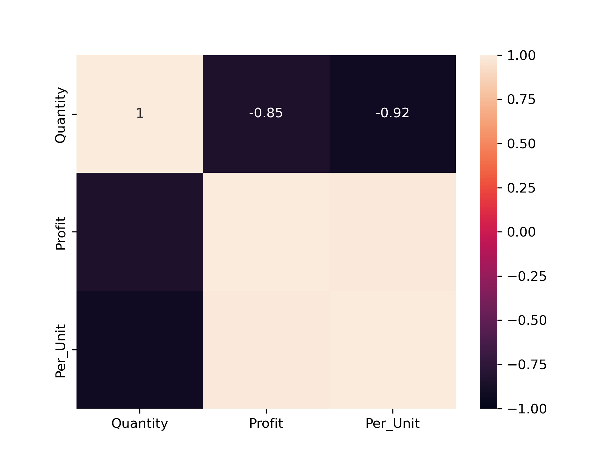
    
### <b> <font color= #ABFF00> Conclusion:
- #### According to the region segment – Yes negative correlation between quantity sold and profit per unit is occurring and negative correlation value = `-0.36`.
- #### According to the Category segment – Yes negative correlation between quantity sold and profit per unit is occurring and Occurring negative correlation value = `-0.92`.

### <b><font color= #FFFF00> Q12. Campaign Impact Simulation:
#### *Assume Walmart ran a 10% discount campaign in August 2024. Recalculate profit for that month and evaluate how the campaign would have affected overall profitability.*

```python
df_aug_10 = pd.DataFrame(df)
df_aug_10.head()
```

```python
df_extract_aug = df_aug_10[(df_aug_10["Order Date"] >= "2024-08-01") & (df_aug_10["Order Date"] <= "2024-08-31")]
df_extract_aug.reset_index().head()
```

```python
august_10_per = df_extract_aug["Profit"] - (df_extract_aug["Profit"] / 100) * 10
august_10_per.head()
```

```python
seperate_aug = df_aug_10["Profit"].sum() - df_extract_aug["Profit"].sum()
seperate_aug
```

```python
overall_10_profit = seperate_aug + august_10_per.sum()
overall_10_profit
```

```python
without_dis = round(df_aug_10["Profit"].sum() / df_aug_10["Profit"].count(), 2)
without_dis
```

```python
with_10_dis = round(overall_10_profit / df_aug_10["Profit"].count(), 2)
with_10_dis
```

### <b> <font color= #ABFF00> Conclusion:
##### *Before 10% discount: ₹25.86 profit/order*
##### *After discount: ₹25.78 profit/order*
##### *Impact = only ₹0.08 difference*
- #### This indicates that Walmart can safely run such discount campaigns without significantly harming profitability.
- #### If the discount leads to even a small boost in sales volume, the overall profit may actually increase.

### <b><font color= #FFFF00> Q13. Return Risk Zones:
#### *If high-quantity orders with low profit are considered risky for returns, which region shows the highest risk exposure?*

```python
df_return_risk = pd.DataFrame(df)
```

```python
df_return_risk.groupby(["Region", "Quantity"])[["Quantity", "Profit"]].sum()
```

```python
sep_east = df_return_risk[(df_return_risk["Region"] == "East") & (df_return_risk["Quantity"] == 9)]
q_east = sep_east["Quantity"].sum()
p_east = sep_east["Profit"].sum()
```

```python
sep_east = df_return_risk[(df_return_risk["Region"] == "South") & (df_return_risk["Quantity"] == 9)]
q_south = sep_east["Quantity"].sum()
p_south = sep_east["Profit"].sum()
```

```python
sep_east = df_return_risk[(df_return_risk["Region"] == "North") & (df_return_risk["Quantity"] == 8)]
q_north = sep_east["Quantity"].sum()
p_north = sep_east["Profit"].sum()
```

```python
sep_east = df_return_risk[(df_return_risk["Region"] == "West") & (df_return_risk["Quantity"] == 8)]
q_west = sep_east["Quantity"].sum()
p_west = sep_east["Profit"].sum()
```

```python
join = pd.DataFrame({
    "Quantity_count" : [q_east, q_south, q_north, q_west],
    "Profit_sum" : [p_east, p_south, p_north, p_west]
             }, index= ["east", "south", "north", "west"])
```

```python
join["Profit_perc"] = (join["Profit_sum"] / join["Profit_sum"].sum()) * 100
join
```

### <b> <font color= #ABFF00> Conclusion:
##### *Based on the Region segmentation East region has Quantity count is 270, total profit is 289.05, and percentage is 11.09% contribution.*
- #### East has high quantity but very low profit, so it is most at risk.

### <b><font color= #FFFF00> Q14. Return Risk Zones:
#### *Calculate how many days (based on order date) it took each region to cross a cumulative profit of ₹5,000. Who was fastest?*

```python
df_time = df.copy()
df_time.head()
```

```python
filter_3 = df_time.groupby(["Region"])["Order Date"].min().reset_index()
filter_3.columns = ["Region", "First_day"]
filter_3
```

### <b> <font color= #ABFF00> Conclusion:
- #### Based The South Region was the fastest to reach ₹1,000 profit in just 34 days from their first order date.
- #### This shows stronger early sales momentum or better margins in that region.

### <b><font color= #FFFF00> Q15. High-Impact Customer Recovery Plan:
#### *Identify the bottom 5% of customers by profit. Suggest a personalized sales strategy for them based on their past order behaviour.*

```python
df_bottom = df.copy()
```

```python
df_bottom.head()
```

```python
df_filter = df_bottom.groupby(["Customer ID"])["Profit"].sum().reset_index()
df_filter = df_fil.sort_values(by= "Profit")
```

```python
df_fill_5 = round((df_filter["Profit"].count()/100)*5)
bottom_5 = df_filter.head(df_fill_5)
```

```python
filtered_bottom_5 = df_bottom[df_bottom["Customer ID"].isin(bottom_5["Customer ID"])]
```

```python
analysis_bottom = filtered_bottom_5.groupby("Quantity")[["Quantity","Sales","Profit"]].sum()
analysis_bottom.columns = ["Quantity_counts", "Sales", "Profit"]
analysis_bottom.reset_index()
```

```python
analysis_bottom["Quantity_per"] = round((analysis_bottom["Quantity_counts"] / analysis_bottom["Quantity_counts"].sum())*100)
```

```python
analysis_bottom["Sales_per"] = round((analysis_bottom["Sales"] / analysis_bottom["Sales"].sum())*100)
```

```python
analysis_bottom["Profit_per"] = round((analysis_bottom["Profit"] / analysis_bottom["Profit"].sum())*100)
```

```python
analysis_bottom
```
### <b> <font color= #ABFF00> Conclusion:
#### All 48 customers in the bottom 5% are one-time customers.
#### High-quantity buyers (Qty > 4) among them are responsible for:
- #### *80% of Quantity*
- #### *60% of Sales*
- #### *56% of (Negative) Profit*
#### These may be discount-driven buyers → suggesting repricing to improve profit.
